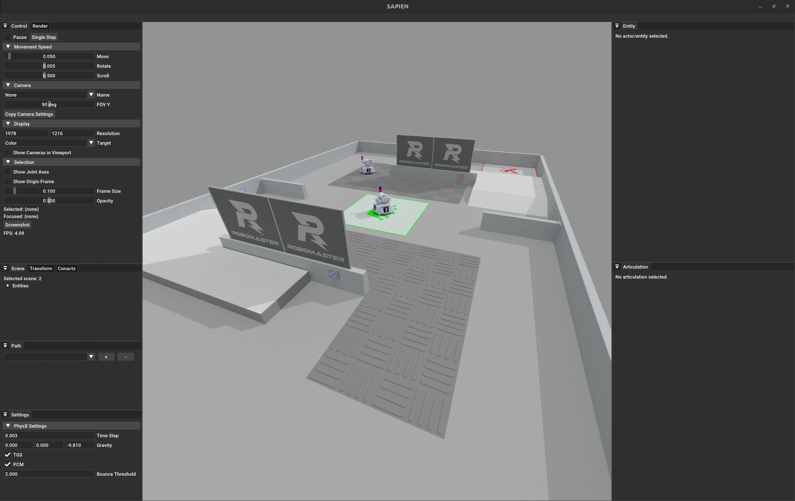
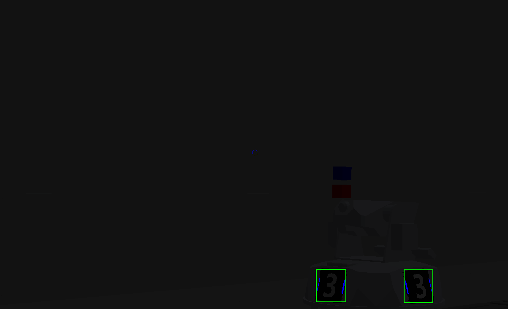
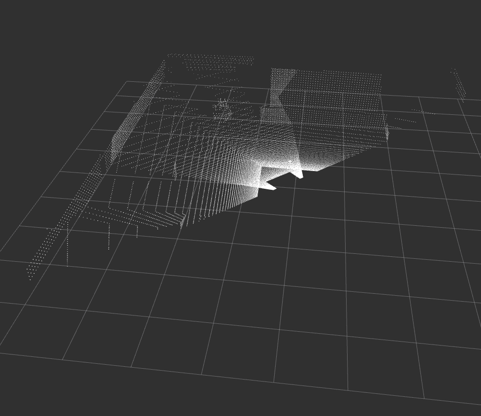

# Simulation-Maniskill

This is a physically grounded, photo-realistic simulator built to seamlessly integrate with the broader TR autonomy ROS2 stack. All sensors (cameras, lidar, imu) are mocked by the simulator allowing for integration testing and rapid prototyping.



### Example of YOLOX inferencing using simulation camera



### Example of simulated lidar pointcloud



### [__Practical usage to measure SolvePnP error__](https://github.com/Triton-Robotics-Training/tr-autonomy-training-visualization)

## Building

To build and integrate with the broader TR autonomy stack please follow the [build instructions in the main repo](https://github.com/Triton-Robotics/TR-Autonomy?tab=readme-ov-file#tr-autonomy-2025)

### If you want to build just the simulator

- ensure you have the `simulation-maniskill` and `utils` submodules inside the /src directory of your ROS2 workspace

```bash
# setup for python venv
apt install python3.10-venv
python3 -m venv .venv
source .venv/bin/activate
pip install -r requirements.txt
# To exit the venv
deactivate

# building ros packages
source /opt/ros/humble/setup.bash
rosdep install -i --from-path src --rosdistro humble -y
colcon build --packages-up-to sim_node
```

## Launching

```bash
source .venv/bin/activate
ros2 launch sim_node sim_with_keyboard_launch.py
```

Look at the main repo for more [launching options](https://github.com/Triton-Robotics/TR-Autonomy?tab=readme-ov-file#launching). Notably launching the entire cv stack alongside the simulator.

## Keyboard Controls

### Primary robot

we do not use WASD because that conflicts with the camera controls of the human GUI.

```
t = forward
f = left 
g = backward
h = right
r = counterclockwise rotation
y = clockwise rotation
```

### Secondary robot

```
i = forward
j = left
k = backward
l = right


5 = stop rotation
4 = 25% counterclockwise rotation
3 = 50% counterclockwise rotation
2 = 75% counterclockwise rotation
1 = 100% counterclockwise rotation
6 = 25% clockwise rotation
7 = 50% clockwise rotation
8 = 75% clockwise rotation
9 = 100% clockwise rotation
```

# NOTE

enabling human gui has a significant performance hit, especially when trying to run faster than real time. Whenever possible disable the `human_gui` ros parameter

some combinations of control_freq, sim_freq, sim_time_scale make the env.step() function take longer than normal to execute in real time. Unsure why
